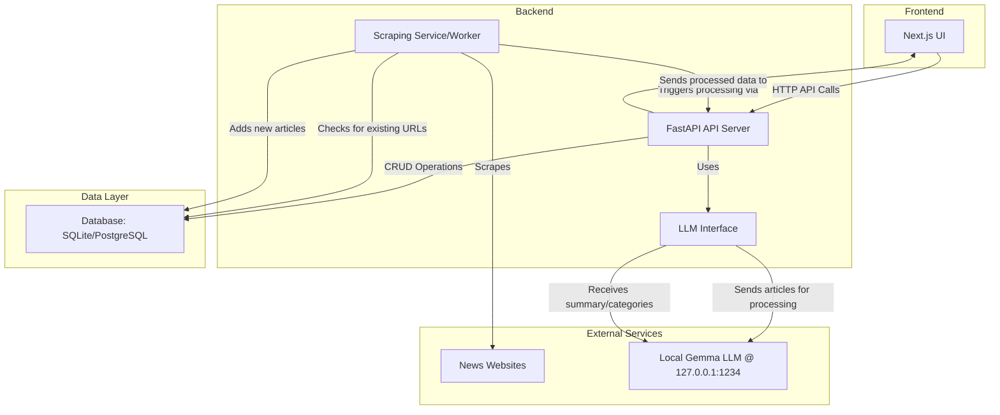

# Project Plan: Personalized News Aggregator

This document outlines the proposed architecture, technology stack, and development strategy for the News Aggregator application. Its purpose is to serve as a foundational blueprint, ensuring all requirements are met and key technical decisions are justified.

## 1. Technology Stack

A full-stack, modern setup is recommended to balance rapid development, performance, and maintainability.

| Component         | Technology                               | Justification                                                                                                                                                                                                                                                                                                                                                                                                                                                                                                                                                                                                                                                                                                                                                                                                                                                                                                                                                                                                                                                                                                                                                                                                                                                                                                                                                                                                                                                                                                                                                                                                                                                                                                                                                                                                                                                                                                                                                                                                                                                                                                                                                                                                                                                                                                                                                                                                                                                                                                                                                                                                                                                                                                                                                                                                                                                                                                                                                                                                                                                                                                                                                                                                                                                                                                                                                                                                                                                                                                                                                                                                                                                                                                                                                                                                                                                                                                                                                                                                                                                                                                                                                                                                                                                                                                                                                                                                                                                                                                                                                                                                                                                                                                                                                                                                                                                                                                                                                                                                                                                                                                                                                                                                                                                                                                                                                                                                                                                                                                                                                                                                                                                                                                                                                                                                                                                                                                                                                                                                                                                                                                                                                                                                                                                                                                                                                                                                                                                                                                                                                                                                                                                                                                                                                                                                                                                                                                                                                                                                                                                                                                                                                                                                                                                                                                                                                                                                                                                                                                                                                                                                                                                                                                                                                                                                                                                                                                                                                                                                                                                                                                                                                                                                                                                                                                                                                                                                                                                                                                                                                                                                                                                                                                                                                                                                                                                                                                                                                                                                                                                                                                                                                                                                                                                                                                                                                                                                                                                                                                                                                                                                                                                                                                                                                                                                                                                                                                                                                                                                                                                                                                                                                                                                                                                                                                                                                                                                                                                                                                                                                                                                                                                                                                                                                                                                                                                                                                                                                                                                                                                                                                                                                                                                                                                                                                                                                                                                                                                                                                                                                                                                                                                                                                                                                                                                                                                                                                                                                                                                                                                                                                                                                                                                                                                                                                                                                                                                                                                                                                                                                                                                                                                                                                                                                                                                                                                                                                                                                                                                                                                                                                                                                                                                                                                                                                                                                                                                                                                                                                                                                                                                                                                                                                                                                                                                                                                                                                                                                                                                                                                                                                                                                                                                                                                                                                                                                                                                                                                                                                                                                                                                                                                                                                                                                                                                                                                                                                                                                                                                                                                                                                                                                                                                                                                                                                                                                                                                                                                                                                                                                                                                                                                                                                                                                                                                                                                                                                                                                                                                                                                                                                                                                                                                                                                                                                                                                                                                                                                                                                                                                                                                                                                                                                                                                                                                                                                                                                                                                                                                                                                                                                                                                                                                                                                                                                                                                                                                                                                                                                                                                                                                                                                                                                                                                                                                                                                                                                                                                                                                                                                                                                                                                                                                                                                                                                                                                                                                                                                                                                                                                                                                                                                                                                                                                                                                                                                                                                                                                                                                                                                                                                                                                                                                                                                                                                                                                                                                                                                                                                                                                                                                                                                                                                                                                                                                                                                                                                                                                                                                                                                                                                                                                                                                                                                                                                                                                                                                                                                                                                                                                                                                                                                                                                                                                                                                                                                                                                                                                                                                                                                                                                                                                                                                                                                                                                                                                                                                                                                                                                                                                                                                                                                                                                                                                                                                                                                                                                                                                                                                                                                                                                                                                                                                                                                                                                                                                                                                                                                                                                                                                                                                                                                                                                                                                                                                                                                                                                                                                                                                                                                                                                                                                                                                                                                                                                                                                                                                                                                                                                                                                                                                                                                                                                                                                                                                                                                                                                                                                                                                                                                                                                                                                                                                                                                                                                                                                                                                                                                                                                                                                                                                                                                                                                                                                                                                                                                                                                                                                                                                                                                                                                                                                                                                                                                                                                                                                                                                                                                                                                                                                                                                                                                                                                                                                                                                                                                                                                                                                                                                                                                                                                                                                                                                                                                                                                                                                                                                                                                                                                                                                                                                                                                                                                                                                                                                                                                                                                                                                                                                                                                                                                                                                                                                                                                                                                                                                                                                                                                                                                                                                                                                                                                                                                                                                                                                                                                                                                                                                                                                                                                                                                                                                                                                                                                                                                                                                                                                                                                                                                                                                                                                                                                                                                                                                                                                                                                                                                                                                                                                                                                                                                                                                                                                                                                                                                                    - |
| :---------------- | :--------------------------------------- | :------------------------------------------------------------------------------------------------- |
| **Backend**       | Python with FastAPI                      | **Why?** Python has a mature ecosystem for web scraping (`requests`, `BeautifulSoup`) and data handling. FastAPI is a modern, high-performance web framework that is easy to learn and supports asynchronous operations, which is ideal for handling I/O-bound tasks like web requests and LLM API calls. |
| **Frontend**      | TypeScript with Next.js (React)          | **Why?** Next.js provides an excellent developer experience with a robust feature set like file-based routing, server-side rendering, and static site generation. TypeScript adds static typing, which helps catch errors early and improves code quality and maintainability. |
| **Database**      | SQLite (for development), PostgreSQL (for production) | **Why?** SQLite is a serverless, self-contained, file-based SQL database engine that is incredibly simple to set up and perfect for local development within a devcontainer. PostgreSQL is a powerful, open-source object-relational database system with a strong reputation for reliability, feature robustness, and performance, making it an ideal choice for production. |
| **Web Scraping**  | `requests` & `BeautifulSoup`             | **Why?** This combination is simple, powerful, and effective for parsing static HTML content from websites. For initial development, it's the fastest way to get started. We can later introduce more powerful tools like `Scrapy` or `Playwright` if we need to handle JavaScript-rendered sites or more complex scraping logic. |
| **LLM Interface** | `requests` or `httpx` (async)            | **Why?** A standard HTTP client is all that's needed to communicate with the OpenAI-like API provided by LM Studio. `httpx` offers a compatible API with `requests` but with added support for asynchronous requests, which integrates perfectly with FastAPI. |

## 2. System Architecture

The system will be designed as a set of interacting services, all managed within a single monorepo and orchestrated by the devcontainer.



**Component Interaction Flow:**

1.  **Scraping:** The `Scraping Service` (which can start as a scheduled script and evolve into a background worker) fetches content from the target `News Websites`.
2.  **Deduplication:** For each scraped article, it checks the URL against the `Database` to see if it has been processed before.
3.  **Storage:** If the article is new, its raw content is saved to the `Database`.
4.  **Processing Trigger:** The scraper notifies the `FastAPI API Server` that a new article needs processing.
5.  **LLM Interaction:** The API server, via the `LLM Interface`, sends the article content to the local `Gemma LLM`. This is where the token limit strategy is applied.
6.  **Data Enrichment:** The LLM returns a summary and a list of categories. The API server updates the article's record in the `Database` with this new information.
7.  **UI Display:** The `Next.js UI` calls the API to fetch the latest personalized articles, which are then displayed to the user.
8.  **User Interaction:** User actions like refining their "interest" prompt, liking/disliking articles, or asking questions are sent as API calls to the backend, which updates user preferences and fetches relevant data from the database.

## 3. Strategy for 8192 Token Context Limit

This is a critical constraint that requires a robust, multi-step approach. We will implement an "Iterative Map-Reduce Summarization" strategy.

**Step 1: Pre-processing and Content Extraction**
Before sending any content to the LLM, we will aggressively clean it.
*   Use a library like `trafilatura` to extract only the core article text, stripping away HTML boilerplate, ads, navigation menus, and comments. This is the single most effective step in reducing token count.

**Step 2: Token Counting**
*   After extraction, use a tokenizer library (e.g., `tiktoken`) to get an accurate token count for the cleaned article text.

**Step 3: The "Map-Reduce" Logic**
*   **If `token_count` <= 8000 (leaving a buffer):**
    *   The article is within the limit. Send the full text to the LLM with a prompt to summarize and categorize it.
*   **If `token_count` > 8000:**
    1.  **Chunking (Map):** Split the text into smaller, overlapping chunks of ~7500 tokens each. The overlap (e.g., 2-3 sentences) helps maintain context between chunks.
    2.  **Iterative Summarization (Map):** Send each chunk to the LLM with a specific prompt: `"This is chunk X of Y of a larger article. Please provide a detailed summary of this chunk: [chunk_text]"`.
    3.  **Final Combination (Reduce):** Once all chunks are summarized, combine these partial summaries. Send the combined text to the LLM with a final prompt: `"The following are summaries from different parts of the same article. Please synthesize them into a single, coherent final summary of 5-7 sentences and provide up to 5 relevant categories for the entire article. The categories should be from this list: [pre-defined list if any, or let it generate]. Summaries: [combined_summaries_text]"`.

> **Why this approach?** It ensures that no part of the article is ignored. By summarizing in stages, we distill the information down to a manageable size for the final, high-level processing, effectively working around the hard token limit while preserving the core meaning of the article.

## 4. Preliminary Database Schema

We will use a relational model to maintain data integrity.


**Table Descriptions:**
*   **`USERS`**: Stores user information, including their personalized "interest" prompt.
*   **`SOURCES`**: A list of websites to be scraped.
*   **`ARTICLES`**: The core table holding all scraped articles. The `url` column must be unique to prevent duplicates.
*   **`CATEGORIES`**: Stores the unique categories generated by the LLM.
*   **`ARTICLE_CATEGORIES`**: A many-to-many join table linking articles to their assigned categories.
*   **`USER_ARTICLE_INTERACTIONS`**: Tracks how a user interacts with an article (e.g., liking, disliking, asking a question). This data is key to automatically refining the user's interest prompt.

## 5. Devcontainer Setup

The `devcontainer.json` will define a consistent and reproducible development environment for everyone working on the project.

**`.devcontainer/devcontainer.json`:**
```json
{
  "name": "News Aggregator",
  "dockerComposeFile": "docker-compose.yml",
  "service": "app",
  "workspaceFolder": "/workspace",
  "customizations": {
    "vscode": {
      "extensions": [
        "ms-python.python",
        "ms-python.black-formatter",
        "ms-python.flake8",
        "esbenp.prettier-vscode",
        "dbaeumer.vscode-eslint",
        "mtxr.sqltools",
        "mtxr.sqltools-driver-sqlite"
      ],
      "settings": {
        "python.defaultInterpreterPath": "/usr/local/bin/python",
        "python.analysis.autoImportCompletions": true
      }
    }
  },
  "forwardPorts": [3000, 8000],
  "postCreateCommand": "pip install -r requirements.txt && npm install"
}
```

**`.devcontainer/docker-compose.yml`:**
```yaml
version: '3.8'
services:
  app:
    build:
      context: .
      dockerfile: Dockerfile
    volumes:
      - ..:/workspace:cached
    command: sleep infinity
  # We can add a PostgreSQL service here later
  # db:
  #   image: postgres:15
  #   environment:
  #     - POSTGRES_USER=vscode
  #     - POSTGRES_PASSWORD=vscode
  #     - POSTGRES_DB=news_aggregator
  #   volumes:
  #     - postgres_data:/var/lib/postgresql/data

# volumes:
#   postgres_data:
```

**`.devcontainer/Dockerfile`:**
```dockerfile
# Use a base image with Python and Node.js pre-installed
FROM mcr.microsoft.com/devcontainers/python:1-3.11-bullseye

# Install Node.js and npm
USER vscode
RUN su - vscode -c "source /usr/local/share/nvm/nvm.sh && nvm install --lts && nvm alias default lts/*"
USER root

# Install project dependencies
COPY requirements.txt /tmp/
RUN pip install --no-cache-dir -r /tmp/requirements.txt

# Copy frontend package files
COPY package.json package-lock.json* ./
RUN npm install
```

> **Why this setup?** This configuration creates a single, isolated environment with all necessary tools (Python, Node.js, linters, formatters) and dependencies pre-installed. It ensures that the application runs the same way on every developer's machine, eliminating "it works on my machine" problems. Starting with `docker-compose` makes it trivial to add a dedicated database service like PostgreSQL later on.