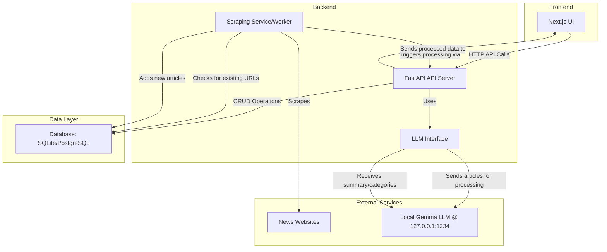

# Personalized News Aggregator

This project is a personalized news aggregator that scans websites, summarizes new articles using a local LLM (Gemma), and displays them based on user interests. The goal is to create a smart, self-hosted news feed that adapts to your preferences.

This document serves as the main entry point for the project. For more detailed information, please refer to the project documentation linked below.

## Current Status

The project has a solid foundation on the backend, with the database models and basic API endpoints established. The frontend, however, is currently just a placeholder and requires a full implementation. The core business logic, including web scraping and LLM interaction, has not yet been developed.

| Component | Plan | Status | Notes |
| :--- | :--- | :--- | :--- |
| **Backend** | Python with FastAPI | ✅ Implemented | The FastAPI application is set up with basic CRUD endpoints for articles. |
| **Frontend** | TypeScript with Next.js | ❌ Not Started | The `package.json` is a placeholder. No Next.js application has been initialized. |
| **Database** | SQLite (dev), PostgreSQL (prod) | ✅ Implemented (Models) | The SQLAlchemy models in `backend/app/models.py` align with the project plan. |
| **Web Scraping** | `requests` & `BeautifulSoup` | ❌ Not Implemented | The necessary libraries are in `requirements.txt`, but no scraping logic exists yet. |
| **LLM Interface** | `requests` or `httpx` | ❌ Not Implemented | The `httpx` library is included, but the interface for the LLM is not built. |
| **Token Limit Strategy** | Iterative Map-Reduce Summarization | ❌ Not Implemented | The logic for handling large articles has not been implemented. |

*For a detailed list of pending tasks, see [`TODO.md`](./TODO.md).*

## Architecture

The system is designed as a set of interacting services, all managed within a single monorepo and orchestrated by a devcontainer.

*The detailed architecture, component interaction flow, and the strategy for handling the LLM's 8192 token limit are documented in the [`PROJECT_PLAN.md`](./PROJECT_PLAN.md).*

## Technology Stack

A full-stack, modern setup was chosen to balance rapid development, performance, and maintainability.

| Component | Technology | Justification |
| :--- | :--- | :--- |
| **Backend** | Python with FastAPI | High-performance, easy to learn, and ideal for I/O-bound tasks. |
| **Frontend** | TypeScript with Next.js (React) | Excellent developer experience, robust feature set, and type safety. |
| **Database** | SQLite (dev), PostgreSQL (prod) | Simple for local development, powerful and reliable for production. |
| **Web Scraping** | `requests` & `BeautifulSoup` | Simple, powerful, and effective for parsing static HTML. |
| **LLM Interface** | `requests` or `httpx` (async) | Standard HTTP clients that integrate perfectly with FastAPI. |

*For a detailed justification of each technology choice, see the [`PROJECT_PLAN.md`](./PROJECT_PLAN.md).*

## Getting Started

This project is configured to run in a **VS Code Devcontainer**.

1.  **Prerequisites**: You must have Docker and the [VS Code Dev Containers extension](https://marketplace.visualstudio.com/items?itemName=ms-vscode-remote.remote-containers) installed.
2.  **Open in Devcontainer**: Open the project folder in VS Code. You will be prompted to "Reopen in Container". Click it.
3.  **Installation**: The devcontainer is configured to automatically install all backend (`pip`) and frontend (`npm`) dependencies when it's created.

Once the container is built and the post-create commands have run, the development environment will be ready.

## Project Documentation

*   **[`PROJECT_PLAN.md`](./PROJECT_PLAN.md)**: The foundational blueprint for the project. It contains the detailed architecture, technology stack, database schema, and the "why" behind key decisions.
*   **[`TODO.md`](./TODO.md)**: The list of all tasks required to complete the project, organized by priority.
*   **[`STATUS.md`](./STATUS.md)**: A snapshot of the current development status, measured against the project plan.