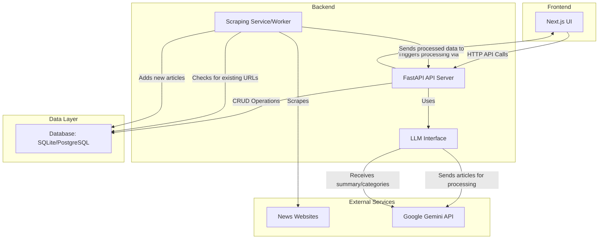

# Personalized News Aggregator

This project is a personalized news aggregator that scans websites, summarizes new articles using a local LLM (Gemma), and displays them based on user interests. The goal is to create a smart, self-hosted news feed that adapts to your preferences.

This document serves as the main entry point for the project. For more detailed information, please refer to the project's [Knowledge Graph](./kg/root.md).

## Current Status

The project has a solid foundation on the backend, with the database models and basic API endpoints established. The frontend is a basic Next.js application that can display articles. The core business logic, including web scraping and LLM interaction, is partially implemented.

| Component | Plan | Status | Notes |
| :--- | :--- | :--- | :--- |
| **Backend** | Python with FastAPI | ✅ Implemented | The FastAPI application is set up with basic CRUD endpoints for articles. |
| **Frontend** | TypeScript with Next.js | ✅ Implemented (Basic) | A Next.js application has been initialized and can display articles. |
| **Database** | SQLite (dev), PostgreSQL (prod) | ✅ Implemented (Models) | The SQLAlchemy models in `backend/app/models.py` align with the project plan. |
| **Web Scraping** | `requests` & `BeautifulSoup` | ✅ Implemented (Basic) | The necessary libraries are in `requirements.txt`, and a basic HTML scraper is implemented. |
| **LLM Interface** | Google Gemini API | ✅ Implemented (Basic) | The `google-generativeai` library is included, and a basic interface for the LLM is built. |
| **Token Limit Strategy** | Iterative Map-Reduce Summarization | ❌ Not Implemented | The logic for handling large articles has not been implemented. |

*For a detailed list of pending tasks, see the [Work Backlog](./kg/03_work_backlog.md).*

## Architecture

The system is designed as a set of interacting services, all managed within a single monorepo and orchestrated by a devcontainer.



*The detailed architecture, component interaction flow, and the strategy for handling the LLM's token limit are documented in the [Knowledge Graph](./kg/root.md).*

## Technology Stack

A full-stack, modern setup was chosen to balance rapid development, performance, and maintainability.

| Component | Technology | Justification |
| :--- | :--- | :--- |
| **Backend** | Python with FastAPI | High-performance, easy to learn, and ideal for I/O-bound tasks. |
| **Frontend** | TypeScript with Next.js (React) | Excellent developer experience, robust feature set, and type safety. |
| **Database** | SQLite (dev), PostgreSQL (prod) | Simple for local development, powerful and reliable for production. |
| **Web Scraping** | `requests` & `BeautifulSoup`, `trafilatura` | Simple, powerful, and effective for parsing static HTML. |
| **LLM Interface** | Google Gemini API | Free access, large context window, and simple to use. |

*For a detailed justification of each technology choice, see the [Technology Stack ADR](./kg/decisions/001-technology-stack.md).*

## Getting Started

This project is configured to run in a **VS Code Devcontainer**.

1.  **Prerequisites**: You must have Docker and the [VS Code Dev Containers extension](https://marketplace.visualstudio.com/items?itemName=ms-vscode-remote.remote-containers) installed.
2.  **Open in Devcontainer**: Open the project folder in VS Code. You will be prompted to "Reopen in Container". Click it.
3.  **Installation**: The devcontainer is configured to automatically install all backend (`pip`) and frontend (`npm`) dependencies when it's created.

Once the container is built and the post-create commands have run, the development environment will be ready.

### Running the Development Servers

**Backend (FastAPI):**
```bash
cd backend
uvicorn app.main:app --reload --host 0.0.0.0 --port 8000
```

**Frontend (Next.js):**
```bash
cd frontend
npm run dev
```

*For more detailed instructions, see [How to: Run Development Servers](./kg/how-to/run_development_servers.md).*

## Project Documentation

The project's documentation is managed in the [Knowledge Graph](./kg/root.md). The Knowledge Graph contains the project's product overview, glossary, work backlog, design decisions, and how-to guides.
