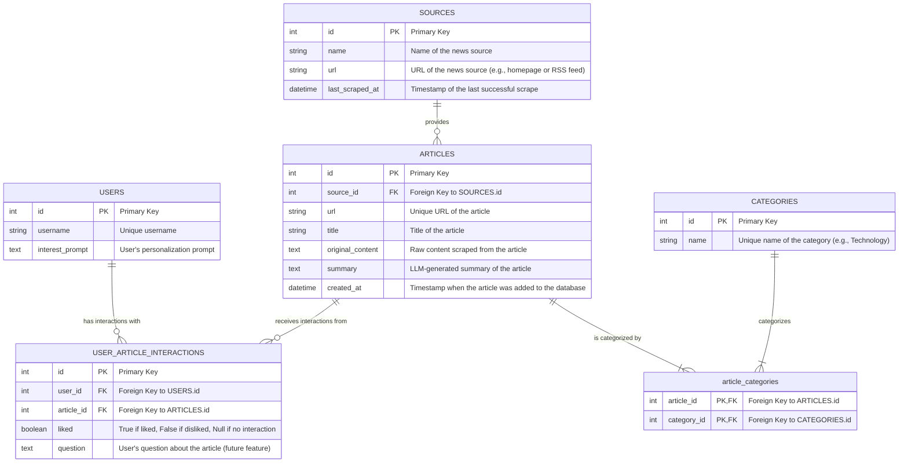

# Data Model: Database Schema

This document describes the database schema for the Personalized News Aggregator project. The schema is implemented using SQLAlchemy in `backend/app/models.py`.

## Entity-Relationship Diagram (Mermaid)

## Table Descriptions

### `USERS`
Stores information about users of the news aggregator.
*   **`id` (Integer, Primary Key):** Unique identifier for the user.
*   **`username` (String, Unique):** User's chosen username.
*   **`interest_prompt` (Text):** A textual prompt defined by the user to specify their news preferences. This prompt is used by the backend to personalize the news feed.

### `SOURCES`
Represents the websites or feeds from which news articles are scraped.
*   **`id` (Integer, Primary Key):** Unique identifier for the source.
*   **`name` (String):** A human-readable name for the source (e.g., "Tech News Site").
*   **`url` (String, Unique):** The base URL of the news source. This could be the homepage, an RSS feed URL, or an API endpoint. Must be unique.
*   **`last_scraped_at` (DateTime):** Timestamp indicating when this source was last successfully scraped. Used for scheduling and tracking.

### `ARTICLES`
The core table storing all scraped news articles.
*   **`id` (Integer, Primary Key):** Unique identifier for the article.
*   **`source_id` (Integer, Foreign Key):** References `SOURCES.id` to link the article to its origin.
*   **`url` (String, Unique):** The direct URL to the article. Must be unique to prevent duplicate entries.
*   **`title` (String):** The title of the news article.
*   **`original_content` (Text):** The raw, unprocessed content of the article as extracted by the scraper (e.g., using `trafilatura`).
*   **`summary` (Text):** The concise summary of the article generated by the LLM.
*   **`created_at` (DateTime):** Timestamp indicating when the article record was created in the database (defaults to UTC now).

### `CATEGORIES`
Stores the unique categories assigned to articles by the LLM.
*   **`id` (Integer, Primary Key):** Unique identifier for the category.
*   **`name` (String, Unique):** The name of the category (e.g., "Technology", "Business", "Sports"). Must be unique.

### `USER_ARTICLE_INTERACTIONS`
Tracks how a specific user interacts with a specific article. This data is key for future personalization improvements.
*   **`id` (Integer, Primary Key):** Unique identifier for the interaction.
*   **`user_id` (Integer, Foreign Key):** References `USERS.id`.
*   **`article_id` (Integer, Foreign Key):** References `ARTICLES.id`.
*   **`liked` (Boolean, Nullable):** Indicates user sentiment. `True` for liked, `False` for disliked. `NULL` if no like/dislike action taken.
*   **`question` (Text, Nullable):** Stores any question a user might ask about the article (a potential future feature).

### `article_categories` (Association Table)
A many-to-many join table linking articles to their assigned categories. An article can belong to multiple categories, and a category can be assigned to multiple articles.
*   **`article_id` (Integer, Primary Key, Foreign Key):** References `ARTICLES.id`.
*   **`category_id` (Integer, Primary Key, Foreign Key):** References `CATEGORIES.id`.
    Both columns together form the primary key of this association table.

## Relationships

*   A `USER` can have many `USER_ARTICLE_INTERACTIONS`.
*   An `ARTICLE` can have many `USER_ARTICLE_INTERACTIONS`.
*   A `SOURCE` can provide many `ARTICLES`.
*   An `ARTICLE` belongs to one `SOURCE`.
*   An `ARTICLE` can have many `CATEGORIES` (via `article_categories`).
*   A `CATEGORY` can be associated with many `ARTICLES` (via `article_categories`).

This schema is designed to be extensible for future features while providing a solid foundation for the current project scope. The actual implementation can be found in `backend/app/models.py`.
